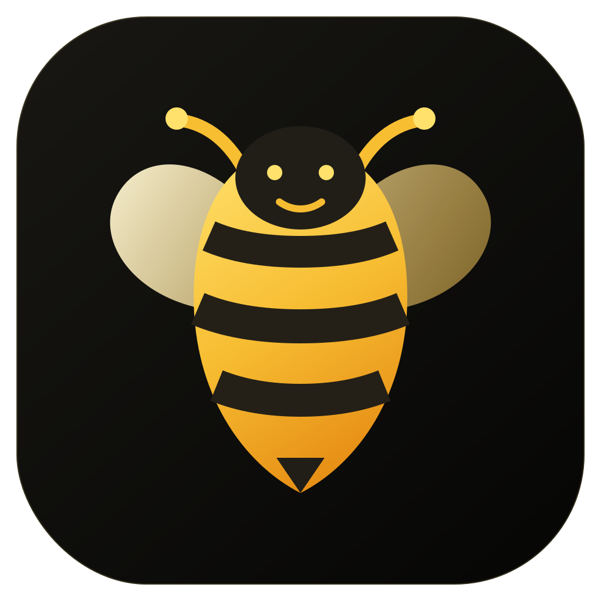

# Bee



A native, privacy-first dictation app built with Tauri 2, Rust, React, Whisper,
and Parakeet. It records from a global shortcut, transcribes locally or through
Groq, cleans the result with a custom dictionary, and pastes it into the active
application.

## Features

- macOS Fn / Globe push-to-talk plus configurable global hold and toggle keys
- compact always-on-top recording widget with live audio levels
- local Whisper Tiny, Base, Small, Medium, Large v3, Distil Large v3, and
  Parakeet V3 model management
- Groq cloud transcription, Polish, and Enhance Prompt
- history, export, statistics, dictionary corrections, and local suggestions
- preferred/fallback microphones, input gain, chimes, cursor-following widget,
  clipboard-only mode, themes, tray operation, and launch at login
- first-run permission and setup flow

## Run

```bash
npm install
npm run desktop:dev
```

## Verify and package

```bash
npm run build
cargo test --manifest-path src-tauri/Cargo.toml --lib
npm run desktop:build
```

On macOS, grant Microphone, Input Monitoring, and Accessibility permissions for
global Fn capture and universal paste. Local model files are downloaded on
demand into the app data directory. A Groq API key is optional and is stored in
the operating system keychain.

Release builds can embed an update feed with `BEE_UPDATE_FEED`. The URL
must return JSON shaped like
`{"version":"1.0.1","notes":"…","url":"https://…/Bee.dmg"}`.
